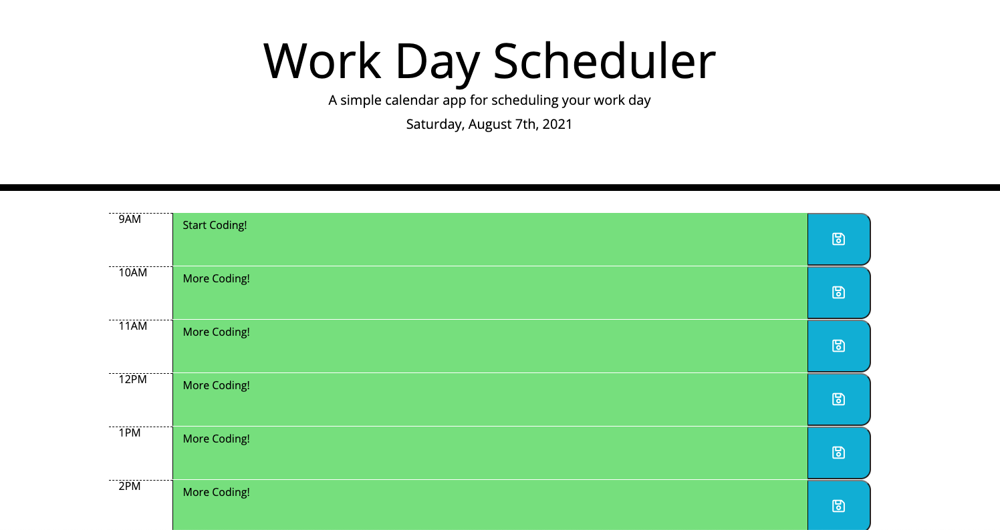

# Homework Assignment #5: Day Planner

## Overview

A day planner web app for users to record text to hourly time blocks from 9am to 5pm for the current datee and store them in the browser for persistence. This app was created with moment.js to get time data and consists of JavaScript and jQuery for the behavior. Time blocks are color-coded based on if the timeblock is in the past, present, or future in relation to the current date/time.

#

> The HTML & CSS in this app was provided. The only code that was modified was the app.js

#

## Link to Deployed Application

[Day Planner App](https://matthewbush55.github.io/day-planner/)

## Mock-Up

